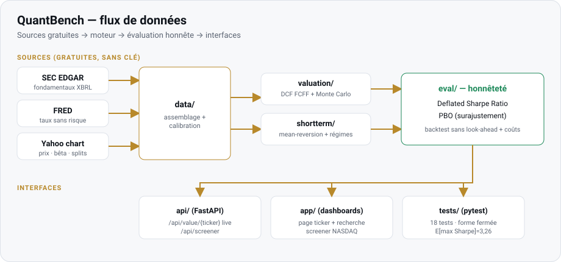

# QuantBench — banc d'essai de valorisation honnête

[](https://github.com/SamuelLachance/quantbench/actions/workflows/ci.yml)
[](LICENSE)
[](https://www.python.org/)

Valorisation intrinsèque **probabiliste** (DCF FCFF multi-phase à la Damodaran + Monte Carlo)
sur **données réelles gratuites** (SEC EDGAR, FRED, marché), plus un volet **court terme**
(mean-reversion + régimes) avec **évaluation anti-surajustement** (Deflated Sharpe + PBO).

> Inspiré de la discipline du fonds Medallion de Jim Simons : ne pas produire une fausse
> précision, mais **mesurer honnêtement l'incertitude** — et refuser de rationaliser le
> prix du marché quand les hypothèses ne le justifient pas.

⚠️ Outil de recherche **éducatif** — ceci n'est **pas** un conseil d'investissement.

## Aperçu



Deux interfaces web (design commun, thèmes clair/sombre, chiffres monospace) :

- **Page ticker** — verdict (valeur médiane vs cours, upside, probabilité de sous-valorisation),
  distribution Monte Carlo interactive (SVG), hypothèses tracées, trajectoires projetées, et une
  **barre de recherche** qui valorise n'importe quel titre en direct via l'API.
- **Screener NASDAQ** — tableau triable de dizaines de titres classés par upside, avec fourchette
  de valeur, probabilité de sous-valorisation, croissance, marge et ROIC ; résultats implausibles
  (splits, données aberrantes) isolés au lieu d'être classés en tête.

> _Captures d'écran :_ lancez l'app (voir ci-dessous), ouvrez `http://localhost:8000`, et
> déposez vos images dans `docs/` — elles s'afficheront ici.

## Résultats d'exemple

Screener NASDAQ (cas de base conservateur, données du dernier exercice déposé) — extrait
trié par valeur :

| Titre | Upside médian | P(sous-val.) | Lecture |
|-------|--------------:|-------------:|---------|
| PYPL  | +20 %         | 88 %         | sous-valorisé selon la base |
| ADBE  | +19 %         | 89 %         | sous-valorisé |
| NVDA  | −5 %          | 43 %         | ~juste valeur (croissance +45 % calibrée) |
| META  | −1 %          | 47 %         | ~juste valeur |
| AAPL  | −67 %         | 0 %          | richement valorisé vs historique |

Volet court terme sur BTC-USD (72 configurations mean-reversion balayées) :

```
Meilleur Sharpe brut : +0.31   |   PSR naïf : 75 %
Deflated Sharpe : 30 %   ·   PBO : 70 %   →   PROBABLE ARTEFACT DU DATA-SNOOPING
```

## Structure

```
quantbench/
  valuation/   dcf.py (moteur FCFF, numpy) + montecarlo.py (copule gaussienne)
  data/        edgar.py (SEC XBRL) + market.py (prix/bêta/taux/splits) + build.py
  eval/        deflated_sharpe.py (DSR/PSR/MinTRL) + pbo.py (CSCV)
  backtest/    engine.py (délai 1 barre + coûts, sans look-ahead)
  shortterm/   signals.py (mean-reversion + Ornstein-Uhlenbeck) + regime.py (GMM)
  service.py   payload complet d'un ticker (CLI + API)
  api/app.py   FastAPI : /api/value/{ticker}, /api/screener + pages statiques
app/           index.html (page ticker) + screener.html + data.json/screener.json
scripts/       value_ticker.py · batch_screener.py · shortterm_demo.py · demo_valuation.py
tests/         18 tests (pytest)
```

## Installation & lancement

```bash
pip install -r requirements.txt
```

Configurez (optionnel) le contact du User-Agent SEC :
```bash
export QUANTBENCH_SEC_UA="Votre Nom votre.email@example.com"
```

Valoriser un titre (écrit `app/data.json`) :
```bash
python scripts/value_ticker.py MSFT
```

Screener d'un univers (écrit `app/screener.json`) :
```bash
python scripts/batch_screener.py
```

Site live (API + pages) :
```bash
uvicorn quantbench.api.app:app --reload --port 8000
# http://localhost:8000  (ticker)  ·  /screener.html  (NASDAQ)  ·  /api/value/NVDA
```

Volet court terme (banc d'essai honnête, anti-overfitting) :
```bash
python scripts/shortterm_demo.py BTC-USD
```

Tests :
```bash
python -m pytest tests/ -q      # 18 tests (DCF + eval + backtest)
```

## Méthode & limites

- **Croissance** calibrée sur l'historique récent (mélange dernier YoY / CAGR 3 ans / CAGR complet, bornée).
- **Réinvestissement** lié au ROIC déclinant (mode Damodaran), pas seulement au ratio ventes/capital.
- **ERP** implicite fixe (~4,5 %), pas le rendement passé du marché (biais rétrospectif corrigé).
- **Splits** corrigés via les événements de fractionnement (actions du 10-K × facteur).
- **Honnêteté** : le cas de base est conservateur ; le Deflated Sharpe et le PBO mesurent le risque
  de surajustement au lieu de le masquer.
- Univers limité aux **grandes capitalisations non-financières** (le DCF FCFF ne convient ni aux
  banques/assureurs ni aux sociétés déficitaires).

## Licence

[MIT](LICENSE) © 2026 Samuel Lachance. Outil de recherche éducatif, sans conseil d'investissement.
